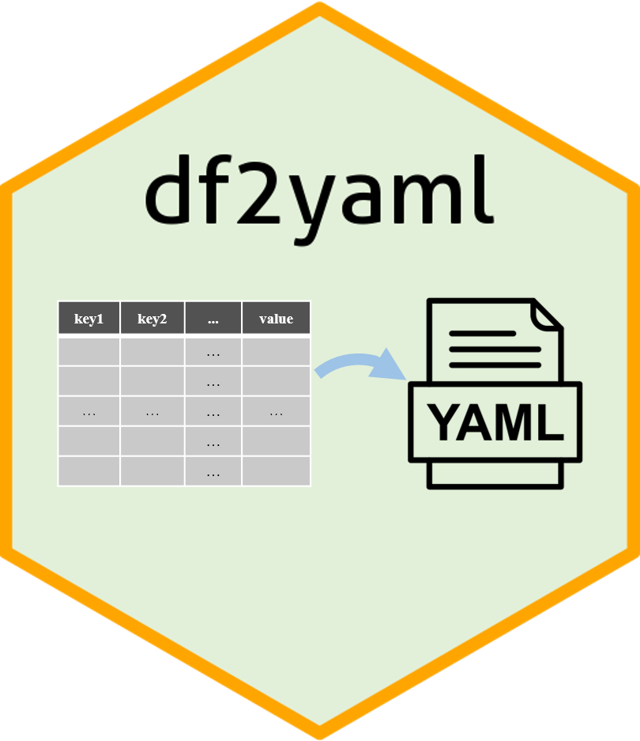

```{r, include = FALSE}
knitr::opts_chunk$set(
  collapse = TRUE,
  comment = "#>",
  dpi=60
)
```

# Getting started

`df2yaml` is an R package distributed as part of the [CRAN](https://cran.r-project.org/).
To install the package, start R and enter:
  
```{r install, eval=FALSE}
# install via CRAN
install.package("df2yaml")
# install via Github
# install.package("remotes")   #In case you have not installed it.
remotes::install_github("showteeth/df2yaml")
```

In general, it is **recommended** to install from [Github repository](https://github.com/showteeth/df2yaml) (update more timely).

Once `df2yaml` is installed, it can be loaded by the following command.

```{r library, message=FALSE, warning=FALSE}
library(df2yaml)
```

-------------

# Introduction


The goal of `df2yaml` is simplify the process of converting dataframe to YAML. The dataframe with multiple key columns and one value column (this column can also contain key-value pair(s)) will be converted to multi-level hierarchy.

-------------

# Usage
Load the test data, this test data contains **two key columns** (`paras` and `subcmd`) and **one value column**, the value column also contains **key and value pair(s) separated by ":"**.
```{r level_3_load}
# library
library(df2yaml)
# load test file
test_file <- system.file("extdata", "df2yaml_l3.txt", package = "df2yaml")
test_data = read.table(file = test_file, header = T, sep = "\t")
head(test_data)
# output yaml string
yaml_res = df2yaml(df = test_data, key_col = c("paras", "subcmd"), val_col = "values")
cat(yaml_res)
```

Convert above dataframe to YAML:
```{r level_3_convert}
yaml_res = df2yaml(df = test_data, key_col = c("paras", "subcmd"), val_col = "values")
cat(yaml_res)
```

<mark>There is no limit to the number of key columns used to convert.</mark>

-------------

# Session info
```{r session}
sessionInfo()
```


